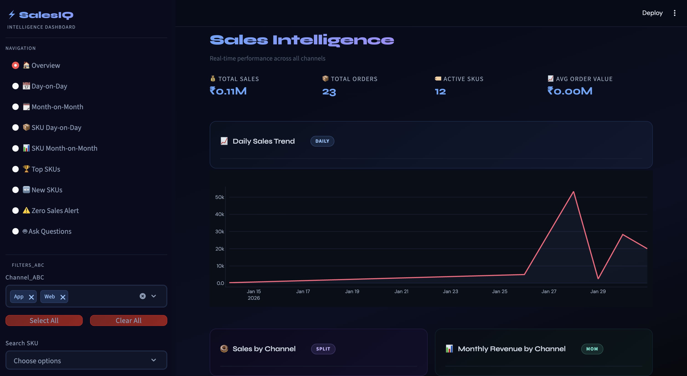
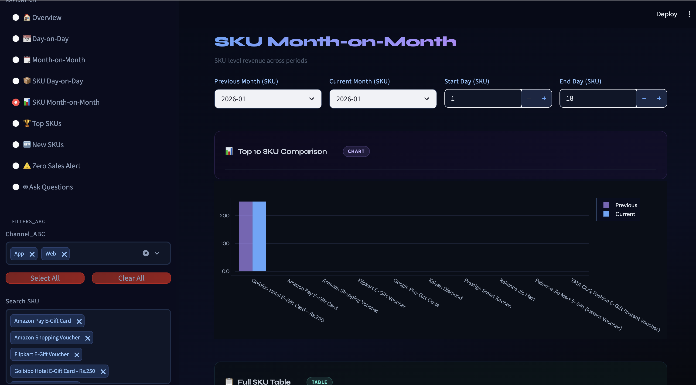

# SalesIQ - Sales Intelligence Dashboard

A Streamlit dashboard for exploring sales performance by channel, SKU, and time period, with built-in exports and a rule-based Q&A assistant.

## Screenshots







## Features

- Interactive navigation across 9 views:
  - Overview
  - Day-on-Day
  - Month-on-Month
  - SKU Day-on-Day
  - SKU Month-on-Month
  - Top SKUs
  - New SKUs (3-month cohort tracking)
  - Zero Sales Alert
  - Ask Questions (no external API required)
- Sidebar filters for:
  - Channel
  - SKU
  - Date range
  - Change threshold (%)
- Download filtered data and page-level tables as Excel files
- Plotly visualizations with custom dark theme
- Cached data loading and aggregations for faster page switching

## Tech Stack

- Python
- Streamlit
- pandas
- plotly
- openpyxl

## Project Structure

- `sales.py`: Main Streamlit application
- `sample_sales_data.xlsx`: Input dataset used by the app

## Requirements

- Python 3.9+
- pip

Install dependencies:

```bash
pip install streamlit pandas openpyxl plotly
```

## Run the App

From the project folder:

```bash
streamlit run sales.py
```

Then open the local URL shown by Streamlit (typically `http://localhost:8501`).

## Data Requirements

The Excel file must include these columns:

- `Date`
- `Channel`
- `SKU`
- `TotalSales`
- `OrderCount`

The app automatically derives `Month` from `Date`.

## Important Path Note

`load_data()` in `sales.py` currently reads a hardcoded file path:

`/Users/rahul/Downloads/sales-report/sample_sales_data.xlsx`

If you move this project, update that path or replace it with a relative path.

## Example Relative Path Change (Recommended)

In `sales.py`, replace:

```python
pd.read_excel(
    "/Users/rahul/Downloads/sales-report/sample_sales_data.xlsx",
    engine="openpyxl"
)
```

with:

```python
pd.read_excel("sample_sales_data.xlsx", engine="openpyxl")
```

## Notes

- The dashboard is optimized for desktop and includes responsive styles for mobile/tablet.
- The "Ask Questions" page is deterministic/rule-based and uses your filtered dataset in memory.
